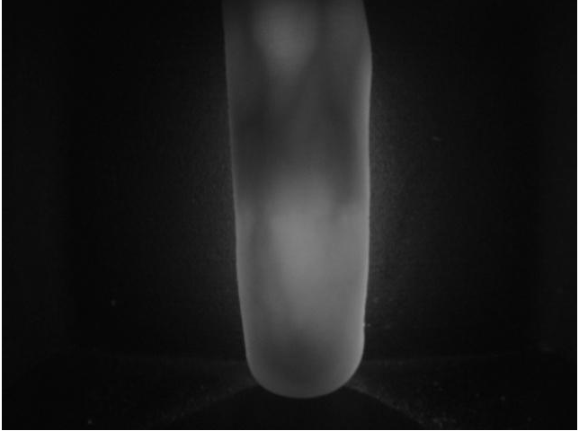
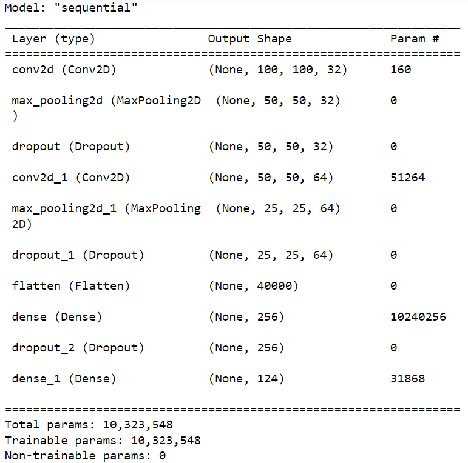
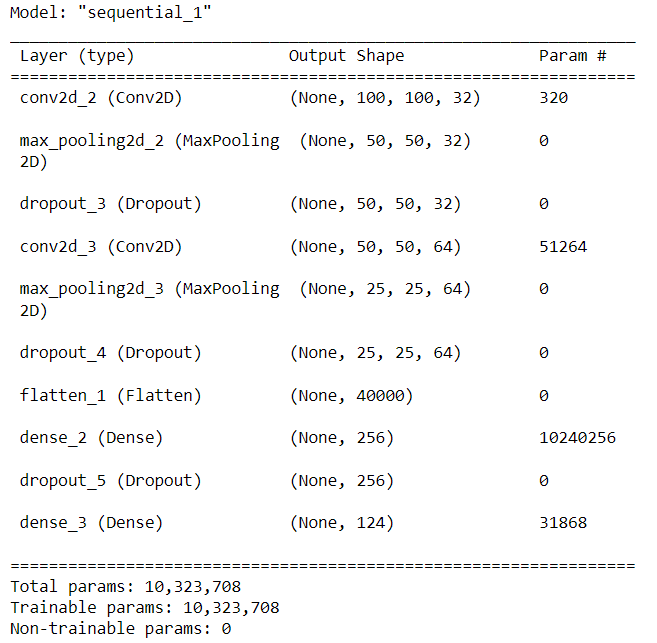
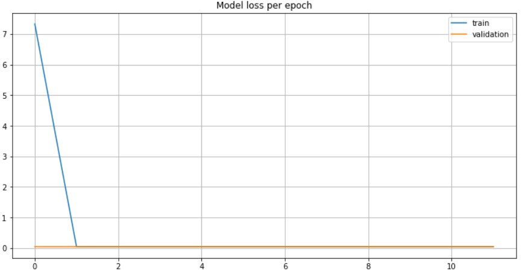

# Finger Vein Biometric Identification Using CNN

This project aims to develop a robust, non-contact biometric identification system using finger vein patterns captured via infrared imaging. Unlike traditional fingerprint-based systems, this approach leverages the unique vein patterns inside fingers, offering improved security and hygiene.

---

## Table of Contents
- [Introduction](#introduction)
- [Dataset](#dataset)
- [Data Preprocessing](#data-preprocessing)
- [Model Architecture](#model-architecture)
- [Hyperparameter Tuning](#hyperparameter-tuning)
- [Results](#results)
- [Limitations](#limitations)
- [How to Use](#how-to-use)
- [References](#references)

---

## Introduction

Biometric systems are crucial for secure and reliable authentication. Traditional methods such as fingerprints or facial recognition have limitations, including hygiene concerns and the potential for tampering. Finger vein recognition overcomes these issues by utilizing the unique vein patterns within fingers, captured through infrared imaging.

---

## Dataset

The dataset consists of infrared images of finger veins from 123 volunteers. Each participant provided images for four fingers (left index, left middle, right index, and right middle), captured in multiple sessions. The dataset includes both raw vein images and extracted patterns.

### Sample Images

#### 1. Infrared Finger Vein Image (Raw Data)
This is a sample of the raw infrared data captured directly from the finger.


#### 2. Preprocessed Vein Pattern
The vein pattern is extracted from the raw data, highlighting the unique structure of the veins.

=======


#### 2. Preprocessed Vein Pattern
The vein pattern is extracted from the raw data, highlighting the unique structure of the veins.


---

## Data Preprocessing

1. **Resizing**: All images were resized to a standard dimension of 100x100 pixels.
2. **Normalization**: Pixel values were normalized to the range [0, 1] for faster model convergence.
3. **Data Augmentation**: Techniques such as rotation, flipping, and zooming were applied to increase dataset diversity.

---

## Model Architecture

The Convolutional Neural Network (CNN) was built using the following architecture:

1. **Input Layer**: Accepts images of size 100x100x3.
2. **Convolutional Layers**: Extract features using multiple filters.
3. **MaxPooling Layers**: Reduce spatial dimensions while retaining features.
4. **Dense Layers**: Perform classification using fully connected layers.
5. **Output Layer**: Uses Softmax activation to classify images into one of the 123 classes.


=======
### Example CNN Architecture Diagram
The network architecture is designed to minimize loss and maximize classification accuracy.


---

## Hyperparameter Tuning

To optimize performance, the following hyperparameters were tuned using Keras Tuner:
- **Number of Filters**: 32 to 128, in steps of 32.
- **Units in Dense Layers**: 64 to 256, in steps of 64.
- **Learning Rate**: [0.01, 0.001, 0.0001].
- **Dropout Rate**: 0.2 to 0.5.

### Training and Validation Accuracy Plot
This plot illustrates the model's performance over epochs.





---

## Results

1. **Test Accuracy**: The model achieved 80.44% accuracy on the test set.
2. **Confusion Matrix**: The classification results for individual IDs are shown below.


=======



3. **Key Observations**:
   - High classification accuracy for specific individuals (e.g., 81.16% for IDs 22 and 43).
   - Minimal overfitting due to effective architecture and regularization.

---

## Limitations

1. **Runtime**: Training the model takes considerable time (~6 hours for 100 epochs).
2. **Scalability**: The model's complexity increases significantly with more classes or higher resolution images.

---

## How to Use

1. Clone the repository:
   ```bash

   git clone https://github.com/<your-username>/Finger-Vein-Biometric-Identification.git
   cd Finger-Vein-Biometric-Identification

   git clone https://github.com/<your-username>/finger-vein-biometrics.git
   cd finger-vein-biometrics

   ```

2. Install dependencies:
   ```bash
   pip install -r requirements.txt
   ```

3. Organize your dataset as follows:
   ```
   data/
   ├── class1/
   │   ├── image1.jpg
   │   ├── image2.jpg
   ├── class2/
   │   ├── image1.jpg
   │   ├── image2.jpg
   ```

4. Run the training script:
   ```bash
   python finger_vein_project.py
   ```

5. View results:
   - Training and validation accuracy plots: `training_validation_accuracy.png`
   - Saved model: `finger_vein_model.h5`

---

## References

1. Mohd Shahrimie Mohd Asaari et al., *Band Limited Phase Only Correlation and Width Centroid Contour Distance for finger-based biometrics*.
2. Ismail Boucherit et al., *Finger vein identification using deeply-fused Convolutional Neural Network*.
